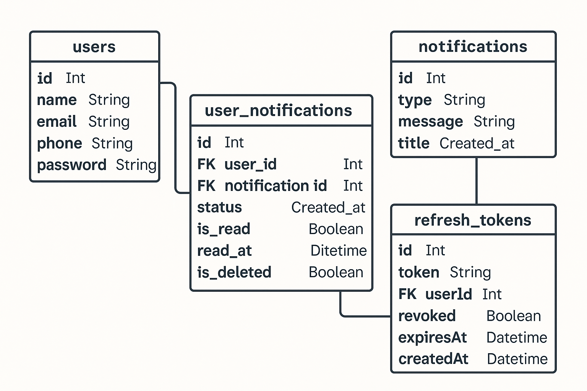

# 🔔 Real-Time Notification System

A production-ready backend system to send real-time push notifications using **Node.js**, **Socket.IO**, **Redis**, **BullMQ**, and **PostgreSQL**. It supports JWT-based authentication, device-wise refresh token management, and secure token rotation.

---

## 📦 Tech Stack

- **Node.js** (Express)
- **TypeScript**
- **Socket.IO** for real-time communication
- **Redis** for Pub/Sub
- **BullMQ** for job queues
- **MySQL** with Prisma ORM
- **Swagger** for API docs
- **JWT** with Refresh Token Rotation
- **Docker** for containerization

---

## 🧠 Features

- ✅ Real-time notification delivery using WebSocket
- ✅ BullMQ + Redis for background job processing
- ✅ Refresh token rotation with device session tracking
- ✅ Secure and scalable architecture
- ✅ Swagger UI for API testing
- ✅ PostgreSQL-based DB design
- ✅ Admin queue dashboard with authentication
- ✅ Socket room-based architecture for user isolation

---


## 📂 Project structure

- dist
- node_modules
- prisma
- src
- ->      assets
- ->      config
- ->      controllers
- ->      dtos
- ->      middleware
- ->      public
- ->      queues
- ->      routes
- ->      scripts
- ->      services
- ->      types
- ->      utils
- ->      workers
- ->      ws
- ->      index.ts
- ->      loadEnv.ts
- .dockerignore
- .env
- .env.development
- .env.production
- .gitignore
- Dockerfile
- package-lock.json
- package.json
- readme.md
- tsconfig.json

---

## 🖼️ High-Level Architecture


---

## 🧱 Database Schema



---

## 🔐 Token Lifecycle Flow (JWT + Refresh Token)


---

## 🔌 API Documentation

Swagger UI available at:

```
https://real-time-notification-system-production.up.railway.app/api-docs/
```

---

## 🚀 Local Development Setup

```bash
# 1. Clone repo
git clone https://github.com/Jayakrishnan-mk/real-time-notification-system

# 2. Install dependencies
npm install

# 3. Start Redis & Postgres via Docker (if not already running)

# 4. Setup env
cp .env.development .env

# 5. Run migrations
npx prisma migrate dev

# 6. Start dev server
npm run dev
```

---

## 🐳 Running with Docker (Production Build)

Build and run using Docker:

```bash
# 1. Build Docker image
docker build -t realtime-notify .

# 2. Run container
docker run -d -p 3000:3000 --env-file .env.production realtime-notify
Or if you're using Docker Compose:

bash
Copy
Edit
docker-compose up --build
Make sure your .env.production is properly set up with:

DATABASE_URL

REDIS_URL

JWT_SECRET

other required variables...
```

---

## 🧪 Testing the Notification Flow

```bash
# You can test real-time notifications by:
- Logging in to get access/refresh tokens
- Opening WebSocket connection with userId
- Hitting /api/notifications to simulate push
```

---

## 🌐 Deployment

Deployed on:
- Railway (Production)

---

## 🤝 Contributing

PRs and suggestions welcome! 🙌

---

## 📄 License

MIT
